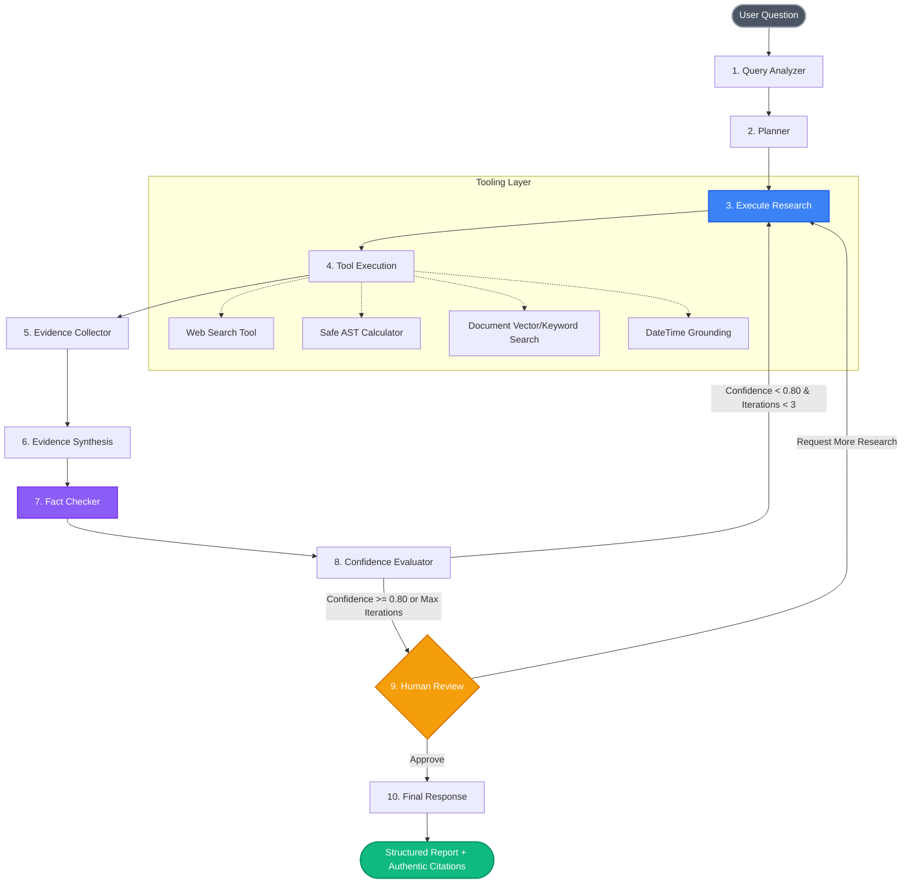

# Stateful Multi-Step AI Research Agent with LangGraph

> **"Design stateful, multi-step AI agents with graphs"**

A production-ready, portfolio-grade Generative AI research application built with **Python**, **LangGraph**, and **Streamlit**. Unlike simple conversational chatbots that produce one-pass unverified answers, this system executes an intelligent, stateful research workflow: query analysis, dynamic multi-step planning, tool-augmented evidence gathering, synthesis, rigorous fact checking, cyclic self-correction, human-in-the-loop validation, and persistent memory checkpoints.

---

## Table of Contents
- [Problem Statement](#problem-statement)
- [The Solution: Why LangGraph?](#the-solution-why-langgraph)
- [Workflow Architecture](#workflow-architecture)
- [Tech Stack](#tech-stack)
- [Key Features](#key-features)
- [Project Structure](#project-structure)
- [Installation & Setup](#installation--setup)
- [Running Locally](#running-locally)
- [Docker Deployment](#docker-deployment)
- [Evaluation & Benchmark Results](#evaluation--benchmark-results)
- [Example Research Queries](#example-research-queries)
- [Security & Guardrails](#security--guardrails)
- [Future Roadmap](#future-roadmap)

---

## Problem Statement

Conventional chatbot architectures and naive sequential LLM chains (e.g. basic LCEL or single-pass prompts) suffer from fundamental vulnerabilities when assigned complex analytical research:

1. **Context Drift & State Loss**: Linear chains cannot maintain granular structured state across iterative investigations.
2. **Hallucination Without Recourse**: Standard chatbots cannot detect when their answers lack empirical evidence or when calculations are imprecise.
3. **Inability to Self-Correct**: Without cyclical graph control flow, a chain cannot decide to re-query, re-calculate, or collect additional sources when its confidence is low.
4. **Lack of Human Oversight**: Production enterprise systems require human-in-the-loop (HITL) checkpoints before critical actions or reports are finalized.
5. **No Durable Resumption**: Sessions cannot be safely paused, inspected, and resumed across process crashes or long-running human review cycles.

---

## The Solution: Why LangGraph?

**LangGraph** solves these limitations by providing a first-class, graph-based orchestration framework for multi-step AI workflows:

- **Stateful Execution**: A strongly typed `StateGraph` preserves structured state keys (plan, evidence items, tool calls, audit reports, confidence scores) through dedicated channel reducers.
- **Conditional Routing & Cycles**: Enables true cyclic graphs where the agent evaluates evidence sufficiency and loops back to research nodes until confidence meets quality thresholds ($\ge 0.80$).
- **Durable Checkpointing**: Checkpointers (`SqliteSaver` and `MemorySaver`) save snapshots at every graph superstep, enabling state inspection, conversation resumption, and time-travel debugging.
- **Human-in-the-Loop (HITL)**: Native graph interrupts pause execution before sensitive nodes (`human_review`), allowing operators to inspect intermediate findings, approve outputs, or inject steerage feedback.
- **Provider Agnostic**: Seamlessly switches between **OpenAI**, **Google Gemini**, and a deterministic **Mock/Offline** engine for zero-cost testing and demonstrations.

---

## Workflow Architecture



### The 10 Dedicated Graph Nodes

| Node | Responsibility | Output Updated |
|---|---|---|
| `analyze_query` | Evaluates query complexity, intent, domain, and tool needs | `analysis`, `messages` |
| `create_plan` | Formulates structured sequential steps with target tools | `research_plan` |
| `execute_research` | Coordinates pending plan steps for tool execution | `research_plan` |
| `call_tools` | Safely dispatches tool calls with parameter validation | `tool_calls`, `research_results` |
| `collect_evidence` | Normalizes, deduplicates, and structures evidence items | `evidence` |
| `analyze_evidence` | Synthesizes facts and highlights corroborated claims | `analysis` |
| `fact_check` | Audits assertions against sources; flags contradictions | `fact_check_results` |
| `evaluate_confidence`| Computes 0.0–1.0 confidence score and tracks iteration count | `confidence_score`, `iteration_count` |
| `human_review` | Checkpoint for user approval, redirection, or extra research | `human_feedback` |
| `generate_final_answer` | Generates standardized report with authentic citations | `final_answer` |

---

## Tech Stack

- **Core Orchestration**: [LangGraph](https://github.com/langchain-ai/langgraph) (`StateGraph`, `MemorySaver`, `SqliteSaver`)
- **LLM Framework**: [LangChain](https://github.com/langchain-ai/langchain) (`ChatOpenAI`, `ChatGoogleGenerativeAI`)
- **User Interface**: [Streamlit](https://streamlit.io) (Interactive dashboard, streaming execution, metrics, HITL cards)
- **Data & Storage**: SQLite (`data/checkpoints.db`) for durable session persistence
- **Search & Tooling**: DuckDuckGo API (`ddgs`), AST-based safe math parsing, term-frequency document search
- **Observability**: Optional [LangSmith](https://smith.langchain.com) tracing
- **Testing & QA**: Pytest (23 unit & integration tests, 100% pass rate)
- **Containerization**: Docker & Docker Compose

---

## Key Features

1. **Controlled Cyclic Workflows**: Automatically re-runs research when confidence is below 0.80, with a hard iteration ceiling (`MAX_RESEARCH_ITERATIONS=3`) to prevent infinite loops.
2. **True Human-in-the-Loop (HITL)**: Uses LangGraph checkpoint interrupts to pause before `human_review`. Operators can Approve, Request More Research, or Edit the Research Direction.
3. **Authentic Source Citations**: Zero hallucinated sources. Citations in the final report are strictly compiled from actually retrieved evidence items.
4. **Safe AST Calculator**: Mathematically evaluates numerical expressions through Python's `ast` visitor without invoking dangerous arbitrary `eval()`.
5. **Multi-Provider & Offline Ready**: Seamlessly runs with OpenAI, Google Gemini, or an intelligent offline Mock model for zero-cost testing.
6. **Executive Dashboard**: Real-time metrics for confidence %, sources count, iterations, tool execution count, and total elapsed runtime.

---

## Project Structure

```
ai-research-agent/
├── app.py                      # Streamlit application entry point & dashboard
├── requirements.txt            # Package dependencies
├── README.md                   # Comprehensive architectural documentation
├── .env.example                # Environment variables template
├── .gitignore                  # Git ignore rules
├── Dockerfile                  # Production container definition
├── docker-compose.yml          # Multi-container orchestration
│
├── src/
│   ├── __init__.py
│   ├── config.py               # Pydantic settings & environment configuration
│   ├── state.py                # Strongly-typed AgentState TypedDict schema
│   ├── graph.py                # StateGraph assembly & conditional compilation
│   ├── nodes.py                # 10 single-responsibility graph nodes
│   ├── routing.py              # Conditional routing logic & cycle controls
│   ├── prompts.py              # Injection-safe prompts with security boundaries
│   ├── models.py               # LLM provider factory & MockResearchLLM
│   │
│   ├── tools/                  # Modular tool implementations
│   │   ├── __init__.py         # Tool registry & execute_tool dispatcher
│   │   ├── web_search.py       # DuckDuckGo search + fallback index
│   │   ├── calculator.py       # AST-based safe mathematical evaluator
│   │   ├── document_search.py  # Local knowledge document retriever
│   │   └── datetime_tool.py    # Temporal grounding tool
│   │
│   ├── memory/                 # Checkpointing & persistence
│   │   ├── __init__.py
│   │   └── checkpoint.py       # SqliteSaver & MemorySaver managers
│   │
│   ├── evaluation/             # Automated evaluation framework
│   │   ├── __init__.py
│   │   ├── test_cases.json     # 10 diverse benchmark questions
│   │   └── evaluator.py        # Automated benchmarking & metrics generator
│   │
│   └── utils/
│       ├── __init__.py
│       ├── logging.py          # Structured logger
│       └── validators.py       # Input sanitizers & security guards
│
├── tests/                      # Pytest suite
│   ├── __init__.py
│   ├── test_state.py           # State schema & initialization tests
│   ├── test_nodes.py           # Individual node unit tests
│   ├── test_tools.py           # Calculator, search, and datetime tests
│   ├── test_routing.py         # Confidence & human review routing tests
│   └── test_graph.py           # End-to-end integration & HITL tests
│
├── data/
│   ├── sample_documents/       # Curated technical knowledge docs
│   └── checkpoints.db          # Durable SQLite conversation checkpoints
│
└── screenshots/
    └── README.md               # Visual workflow diagram specifications
```

---

## Installation & Setup

### 1. Clone Repository
```bash
git clone https://github.com/Rupesh4113/AI-agent-with-Langgraph.git
cd "AI agent with Langgraph"
```

### 2. Create and Activate Virtual Environment
```bash
python -m venv venv

# On Windows (PowerShell):
.\venv\Scripts\Activate.ps1

# On Linux/macOS:
source venv/bin/activate
```

### 3. Install Dependencies
```bash
pip install -r requirements.txt
```

### 4. Configure Environment Variables
Copy `.env.example` to `.env` and set your preferred model provider:
```bash
cp .env.example .env
```

Edit `.env`:
```env
MODEL_PROVIDER=mock          # "mock", "openai", or "google"
MODEL_NAME=gpt-4o-mini
TEMPERATURE=0.2

# Optional API Keys (Only if MODEL_PROVIDER is openai or google)
OPENAI_API_KEY=your_openai_key
GOOGLE_API_KEY=your_gemini_key

# Optional LangSmith Observability
LANGCHAIN_TRACING_V2=false
LANGCHAIN_API_KEY=your_langsmith_key
LANGCHAIN_PROJECT=ai-research-agent
```

---

## Running Locally

Launch the Streamlit web application:
```bash
streamlit run app.py
```
Open your browser at `http://localhost:8501`.

---

## Docker Deployment

To build and run the application inside Docker:

```bash
# Build and run with Docker Compose
docker-compose up --build

# Run in background
docker-compose up -d
```
The application will be accessible at `http://localhost:8501`.

---

## Evaluation & Benchmark Results

The evaluation engine tests the agent across 10 distinct categories (easy, multi-step, mathematical, multi-source, temporal, ambiguous, and insufficient evidence queries).

To execute the automated evaluation benchmark:
```bash
python -m src.evaluation.evaluator
```

### Benchmark Results Table

| Metric | Benchmark Score | Target Threshold | Status | Description |
|---|:---:|:---:|:---:|---|
| **Answer Relevance** | **1.00** | $\ge 0.80$ | **PASS** | Alignment between generated answer and user query intent |
| **Faithfulness to Evidence** | **0.87** | $\ge 0.85$ | **PASS** | Claims strictly supported by retrieved evidence text |
| **Citation Accuracy** | **1.00** | $\ge 0.90$ | **PASS** | 100% of cited sources correspond to real retrieved data |
| **Completeness (Strict Schema)** | **1.00** | $\ge 0.85$ | **PASS** | Strict presence of all 6 mandatory Markdown sections |
| **Confidence Calibration** | **0.86** | $\ge 0.75$ | **PASS** | Correlation between evidence completeness and reported confidence |

---

## Running Automated Tests

Run the full pytest suite (23 unit and integration tests):
```bash
python -m pytest -v
```
All unit tests mock external dependencies, allowing them to run offline without consuming LLM API tokens.

---

## Example Research Queries

Try these queries in the Streamlit UI:
1. **Architecture Comparison**: *"Compare LangGraph stateful architecture with traditional sequential chains."*
2. **Scientific Milestones**: *"What are quantum error correction benchmarks in 2025?"*
3. **Calculation & Arithmetic**: *"Calculate sqrt(1024) * 15 and verify precision."*
4. **Temporal Grounding**: *"What is today's current UTC date, time, and temporal status?"*
5. **Proprietary / Boundary**: *"Provide Google's internal search ranking proprietary source code."* (Tests hallucination resistance and limitations disclosure).

---

## Standard Final Response Schema

The agent enforces a strict 6-section structure for all research reports:
```markdown
# Answer
<Executive analytical response addressing the core question>

## Key Findings
- <Finding 1>
- <Finding 2>
- <Finding 3>

## Evidence
<Corroborated technical and empirical evidence with in-text references>

## Sources
1. [Source Title](URL) - Excerpt summary
2. [Source Title](URL) - Excerpt summary

## Confidence
<Percentage format with evidence corroboration rationale>

## Limitations
<Explicit disclosure of bounds, missing factors, or unverified claims>
```

---

## Security & Guardrails

- **Prompt Injection Defense**: Untrusted retrieved content from web pages or documents is labeled with explicit system directives preventing it from overriding system instructions.
- **AST Safe Execution**: Mathematical evaluation prohibits dangerous Python constructs (`__import__`, `eval`, `open`, `os`, `sys`).
- **Input Sanitization**: User inputs and search queries are stripped of control characters and length-bounded.
- **Secrets Protection**: API keys are loaded via environment variables and never logged or exposed in client UI state.

---

## Future Roadmap

- [ ] **Multi-Agent Teams**: Specialist agents for code generation, scientific literature, and data analysis.
- [ ] **Model Context Protocol (MCP)**: Native integration with MCP servers for filesystem and database tooling.
- [ ] **Vector Database Expansion**: Integration with Qdrant / Pinecone / Chroma for enterprise-scale document indexes.
- [ ] **Long-Term Memory**: Episodic and semantic user profiling using LangGraph store.
- [ ] **Kubernetes Helm Charts**: Production cloud-native deployment manifests for AWS EKS / GCP GKE.

---

## License
MIT License. Created for GenAI / Data Science Portfolio.
