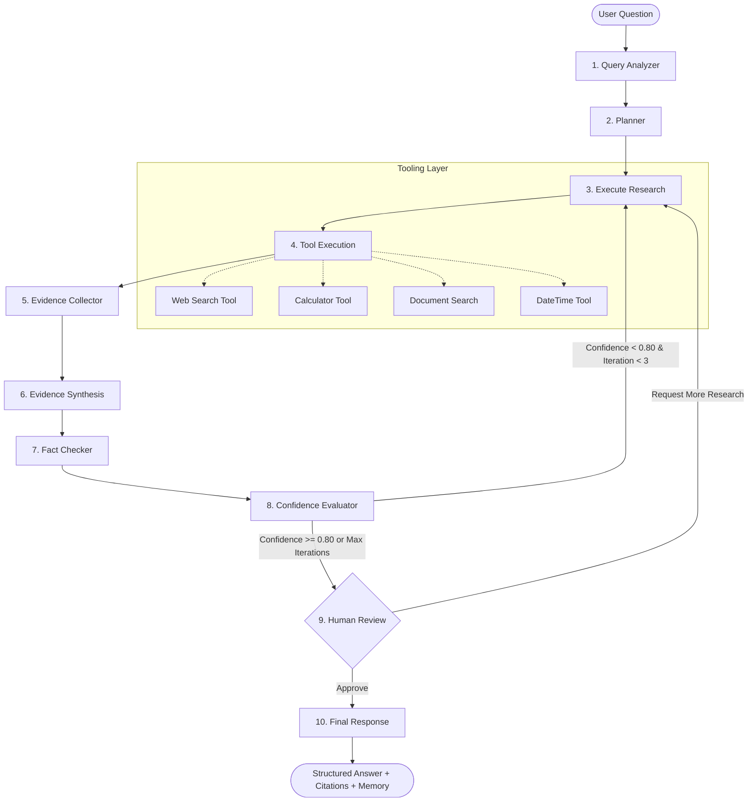

# Workflow Diagram Specification

This directory contains visual architecture diagrams and UI screenshots for the Stateful Multi-Step AI Research Agent.

```mermaid
flowchart TD
    START([User Question]) --> analyze_query[1. Query Analyzer]
    analyze_query --> create_plan[2. Planner]
    create_plan --> execute_research[3. Execute Research]
    
    subgraph Tooling Layer
        execute_research --> call_tools[4. Tool Execution]
        call_tools -.-> WebSearch[Web Search Tool]
        call_tools -.-> Calculator[Calculator Tool]
        call_tools -.-> DocSearch[Document Search]
        call_tools -.-> DateTime[DateTime Tool]
    end

    call_tools --> collect_evidence[5. Evidence Collector]
    collect_evidence --> analyze_evidence[6. Evidence Synthesis]
    analyze_evidence --> fact_check[7. Fact Checker]
    fact_check --> evaluate_confidence[8. Confidence Evaluator]

    evaluate_confidence -->|Confidence < 0.80 & Iteration < 3| execute_research
    evaluate_confidence -->|Confidence >= 0.80 or Max Iterations| human_review{9. Human Review}

    human_review -->|Request More Research| execute_research
    human_review -->|Approve| generate_final_answer[10. Final Response]

    generate_final_answer --> END([Structured Answer + Citations + Memory])
```
